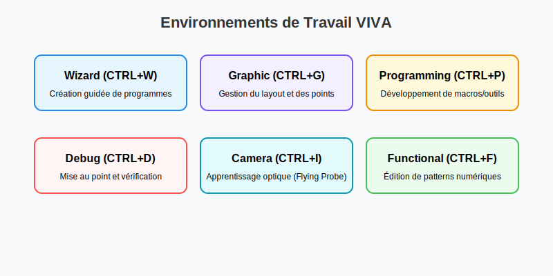

# DICTIONNAIRE COMPLET DU LANGAGE SEICA
## Guide de Référence pour la Programmation de Tests

> **Note :** Ce dictionnaire est également disponible en versions spécialisées :
> - [**Dictionnaire LOGICIEL**](./VIVA_SOFTWARE_DICTIONARY.md) (Langage, Logique, Pré-processeur)
> - [**Dictionnaire MATÉRIEL**](./VIVA_HARDWARE_DICTIONARY.md) (Modules HV, USB, GEN, JTAG, Alimentations)


*Figure 1 : Vue d'ensemble de l'architecture logicielle et matérielle Viva.*

---

## TABLE DES MATIÈRES

1. [PRÉSENTATION DU LOGICIEL SEICA](#1-présentation-du-logiciel-seica)
2. [ENVIRONNEMENT WIZARD (ASSISTANT)](#2-environnement-wizard-assistant)
3. [MÉTHODES DE MESURE & GUARDING](#3-méthodes-de-mesure--guarding)
4. [MACROS DE TEST ANALOGIQUE (R, C, L, FNODE)](#4-macros-de-test-analogique-r-c-l-fnode)
5. [MACROS SEMI-CONDUCTEURS & PUISSANCE](#5-macros-semi-conducteurs--puissance)
6. [MACROS VECTORLESS & SERVICE](#6-macros-vectorless--service)
7. [GUIDE DU LANGAGE SEICA (STATIC & DYNAMIC)](#7-guide-du-langage-seica-static--dynamic)
8. [TIMING & PATTERNS (SYNCHRONISATION)](#8-timing--patterns-synchronisation)
9. [PRÉ-PROCESSEUR & DIRECTIVES COMPILATEUR](#9-pré-processeur--directives-compilateur)
10. [DÉCLARATIONS & STRUCTURES DE DONNÉES](#10-déclarations--structures-de-données)
11. [CONTRÔLE DE FLUX & LOGIQUE](#11-contrôle-de-flux--logique)
12. [OUTILS VNL (SEICA NATIVE LANGUAGE)](#12-outils-vnl-seica-native-language)
13. [INSTRUMENTS & MATÉRIEL (ANALOGIQUE & NUMÉRIQUE)](#13-instruments--matériel-analogique--numérique)
14. [GESTION DE L'ALIMENTATION (SE2 / SE5)](#14-gestion-de-lalimentation-se2--se5)
15. [MODULE DE BRASAGE LASER (SOLD)](#15-module-de-brasage-laser-sold)
16. [COMMANDES NUMÉRIQUES DÉTAILLÉES](#16-commandes-numériques-détaillées)
17. [MODULE HAUTE TENSION (HV)](#17-module-haute-tension-hv)
18. [MODULE USB & ZONE UTILISATEUR](#18-module-usb--zone-utilisateur)
19. [MODULE GÉNÉRATEUR DE FONCTIONS (GEN)](#19-module-générateur-de-fonctions-gen)
20. [MODULE F40 (HIGH FREQUENCY)](#20-module-f40-high-frequency)
21. [OPTION DIGIPLEX (DIGITAL MULTIPLEXER)](#21-option-digiplex-digital-multiplexer)
22. [COMMUNICATION IEEE / GPIB](#22-communication-ieee--gpib)
23. [VECTEURS ALGORITHMIQUES](#23-vecteurs-algorithmiques)
24. [ENTRÉE / SORTIE & INTERFACE UTILISATEUR](#24-entrée--sortie--interface-utilisateur)
25. [FONCTIONS MATHÉMATIQUES & VARIABLES SYSTÈME](#25-functions-mathématiques--variables-système)
26. [COMMUNICATION & INTERFACES EXTERNES (API, VBS, JTAG)](#26-communication--interfaces-externes-api-vbs-jtag)



---

## 1. PRÉSENTATION DU LOGICIEL SEICA

### [Aperçu et Gestion des Utilisateurs](./docs/software/viva_overview.md)
Le logiciel VIVA centralise le développement, le débogage et l'exécution des tests.
- **Rôles :** Opérateur, Développeur, Administrateur.
- **Gestionnaires :** System Manager, User Manager, Program Manager.

---

## 2. ENVIRONNEMENT WIZARD (ASSISTANT)

### [Flux de Travail Wizard](./docs/software/wizard_environment.md)
Procédure guidée en trois étapes pour la création de programmes.
- **PREPARE :** Importation CAD/BOM, édition de données, création automatique.
- **VERIFY :** Setup du programme, alignement optique, vérification.
- **TEST :** Exécution en production.


---

## 3. MÉTHODES DE MESURE & GUARDING

### [Configurations de Mesure](./docs/software/measurement_methods.md)
VIVA supporte des mesures complexes pour garantir la précision.
- **Modes :** 2, 3, 4 (Kelvin) et 6 fils.
- **Guarding :** Active et Passive pour l'isolation des composants in-circuit.
- **Instruments :** Pilotage via le bus analogique interne (8 lignes).

---

## 4. MACROS DE TEST ANALOGIQUE (R, C, L, FNODE)

### [Composants Passifs](./docs/software/analog_macros.md)
Macros pour la mesure de précision des composants R, C, L.
- **FNODE :** Analyse harmonique par FFT pour le test de réseaux.
- **Tolérances :** Gestion des limites symétriques et asymétriques.

---

## 5. MACROS SEMI-CONDUCTEURS & PUISSANCE

### [Composants Actifs & Alimentation](./docs/software/power_active_macros.md)
Pilotage des semi-conducteurs et des unités de puissance.
- **Semi-conducteurs :** Diode, Zener, SCR, Triac, Transistor.
- **Power :** Séquences de mise sous tension sécurisées.
- **Soldering :** Paramètres du brasage laser "Donut".

---

## 6. MACROS VECTORLESS & SERVICE

### [Tests Vectorless & Utilitaires](./docs/software/vectorless_service_macros.md)
Tests avancés hors tension et fonctions de service.
- **Vectorless :** AUTIC, JSCAN, OPENFIX (sonde capacitive).
- **Service :** Jumper, Fuse, Discharge (protection UUT).
- **Interface :** Message et AskUser via VBScript.

---

## 7. GUIDE DU LANGAGE SEICA (STATIC & DYNAMIC)

### [Concepts Fondamentaux](./docs/software/language/VIVA_Language_Guide.md)
Le langage VIVA est un langage structuré de haut niveau gérant les tests statiques (PC) et dynamiques (DSP).
- **Types :** INTEGER (32 bits), FLOAT (Double), STRING (255 chars), ARRAYS.
- **Flags :** Gestion des erreurs partielles (Runtime) et globales (Final).
- **Environnements :** `STATIC` pour l'init, `DYNAMIC` pour les patterns haute vitesse.

---

## 8. TIMING & PATTERNS (SYNCHRONISATION)

### [Gestion du Timing](./docs/software/language/Timing_and_Patterns.md)
Définition de la synchronisation temporelle pour les tests haute vitesse (F40/DHF).
- **Paramètres :** PERIOD, DEAD, OVERLAY, PHASE, ASSERT, STROBE.
- **Patterns :** Unité d'exécution dynamique séparée par `/`.
- **Boucles :** `BEGINLOOP` / `ENDLOOP` avec conditions d'arrêt (`ONERROR`, `ONPASS`).


---

## 9. PRÉ-PROCESSEUR & DIRECTIVES COMPILATEUR

### @COMPILER
Définit les paramètres globaux de compilation.
- **Syntaxe :** `@COMPILER <option> = <valeur>;`
- **Options :** `MAX_ERROR`, `COMPLEX`, `VARNAME_LEN`, `BACKUP`.

### #INCLUDE
Inclut un fichier bibliothèque externe (.LIB).
- **Syntaxe :** `#INCLUDE <nom_fichier>;`

---

## 10. DÉCLARATIONS & STRUCTURES DE DONNÉES

### DECLARE
Définit des objets (variables, canaux, signaux).
- **Types :** `VARIABLE INTEGER`, `VARIABLE FLOAT`, `VARIABLE STRING`, `CHANNEL`, `SIGNAL`.

### DECLARE RUNTIME ARRAY / INDEX
Structures de données pour l'exécution.
- **Syntaxe :** `DECLARE RUNTIME <type> ARRAY <nom>[<dim>];`

---

## 11. CONTRÔLE DE FLUX & LOGIQUE

### START / ENDTEST
Délimite le bloc principal.

### ~IF / ~ELSE / ~ENDIF
Conditionnelle Runtime.

### ~FOR / ~ENDFOR
Boucle Runtime avec compteur.

---

## 12. OUTILS VNL (SEICA NATIVE LANGUAGE)

### [Outils et Méthodes VNL](./docs/software/logic/VNL_TOOLS.md)
Le VNL est une approche orientée objet pour le pilotage des ressources.
- **TEST :** Gestion de l'affichage et des paramètres.
- **EXPRESSION :** Calculs et assignations.
- **VBS :** Exécution de scripts Visual Basic.


---

## 13. INSTRUMENTS & MATÉRIEL (ANALOGIQUE & NUMÉRIQUE)

### ~MEASURE
Instruction de haut niveau pour les mesures.
- **Types :** `Voltage`, `Current`, `Frequency`, `Time`.

### ~ATEST
Comparaison avec limites et gestion d'erreurs.

### ~SET PW ALL
Contrôle global des alimentations.

---

## 14. GESTION DE L'ALIMENTATION (SE2 / SE5)

### [Carte SE5 (Power Supply Management)](./docs/hardware/modules/SE5_Board.md)
Module de nouvelle génération pour la gestion de l'alimentation.
- **Capacité :** Jusqu'à 8 unités PW.
- **Matrice :** Alimentation de l'UUT via sondes jusqu'à 2A.

---

## 15. MODULE DE BRASAGE LASER (SOLD)

### [Macro SOLD](./docs/software/power_active_macros.md)
Pilotage du système de brasage laser haute précision.
- **Technologie :** Spot laser "DONUT" pour une répartition thermique optimale.

---

## 16. COMMANDES NUMÉRIQUES DÉTAILLÉES

### STRUCTURE DES COMMANDES
- **D/S :** Driver (Sortie) / Sensor (Entrée).
- **L/H :** État logique Bas / Haut.
- **M/S :** Masked (Ignoré) / Sensed (Mesuré).
- **FORMAT :** Nret, Rzero, Rone, Rzeta.

---

## 17. MODULE HAUTE TENSION (HV)

### ~PCT
Contrôle les contacts PCT du module Haute Tension.

### ~PLn
Contrôle la connexion des canaux HV sur les lignes internes (PL1 à PL4).

---

## 18. MODULE USB & ZONE UTILISATEUR

### ~SET USER_BUSW / ~SET USER_DAC
Bus numériques et convertisseurs DAC utilisateur.

### ~SET USER_LOAD / ~SET USER_WORD
Charges résistives et lignes CUSTOM.

---

## 19. MODULE GÉNÉRATEUR DE FONCTIONS (GEN)

### ~SET USER_GEN
Configuration du générateur de fonctions (5Hz à 5MHz).

### ~MEAS USER_GEN
Mesure RMS vers DC via le module GEN.

---

## 20. MODULE F40 (HIGH FREQUENCY)

### [Timing & Synchronisation](./docs/software/language/Timing_and_Patterns.md)
Module de test numérique haute vitesse (25MHz).
- **Instructions Spécifiques :** `~ROUT`, `~PULLUP/DOWN`, `~MUXOUT`.

---

## 21. OPTION DIGIPLEX (DIGITAL MULTIPLEXER)

### [Technique Digiplex](./docs/hardware/modules/digiplex_option.md)
Permet le test numérique sur les canaux analogiques du scanner.
- **Syntaxe .LIB :** `#CompName`, `!CompType`, `*PI`, `*TY`, `@L`.
- **Commandes :** `~SET DIGIPLEX [PULL UP|PULL DOWN|LOAD|HOLD]`.

---

## 22. COMMUNICATION IEEE / GPIB

### ~SET BUS / ~SEND_IEEE / ~READ_IEEE
Pilotage d'instruments externes via bus GPIB.

---

## 23. VECTEURS ALGORITHMIQUES

### ACCI / ACCD / ACSR / ACSL
Opérations sur l'accumulateur matériel (F50).

### ACRC
Calcul de CRC matériel en temps réel.

---

## 24. ENTRÉE / SORTIE & INTERFACE UTILISATEUR

### ~WRITE / ~WRITEL
Affichage terminal avec attributs de formatage.

### ~MSG / ~ASKUSER
Interactions utilisateur via boîtes de dialogue.

---

## 25. FONCTIONS MATHÉMATIQUES & VARIABLES SYSTÈME

### ~CALC
Opérations arithmétiques et logiques Runtime.

### VARIABLES SYSTÈME
- `AR` : Registre analogique (FLOAT).
- `NC` : Compteur numérique (INTEGER).
- `ERR` : Flag d'erreur global.

---

## 26. COMMUNICATION & INTERFACES EXTERNES (API, VBS, JTAG)

### ~API / ~VBS
Appel de DLL Windows et scripts VBScript.

### Boundary Scan (JTAG)
Configuration de l'interface JTAG et des chaînes de composants.

---
*Fin du Dictionnaire SEICA - Version Complète*

## EXEMPLES DE PROGRAMMES COMPLETS

### Test de Continuité (Static)
```viva
START CONTINUITE;
  ~WRITE "Test de continuité en cours...";
  RESISTOR Value=0.5 TolPos=10 TolNeg=10 Pin1=1 Pin2=2;
  ~ATEST AR NAME="R1" LO=0.4 HI=0.6;
ENDTEST;
```

### Test Numérique (Dynamic)
```viva
START LOGIQUE;
  ~CHLEV VH=3.3 VL=0;
  ~ROUT RS1=50;
  / 0011 / 1100 / 1010 /;
ENDTEST;
```
