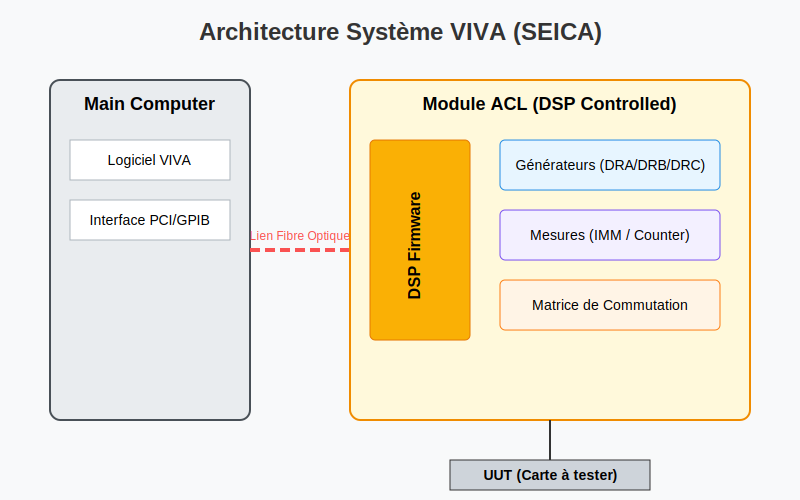

# DICTIONNAIRE MATÉRIEL SEICA
## Guide de Référence des Modules et Instruments de Test

---

## TABLE DES MATIÈRES

1. [GESTION DE L'ALIMENTATION (POWERON / POWEROFF)](#1-gestion-de-lalimentation-poweron--poweroff)
2. [COMMANDES NUMÉRIQUES DÉTAILLÉES (MODES & FORMATS)](#2-commandes-numériques-détaillées-modes--formats)
3. [INSTRUMENTS ANALOGIQUES & MESURES](#3-instruments-analogiques--mesures)
4. [MODULE HAUTE TENSION (HV - HIGH VOLTAGE)](#4-module-haute-tension-hv---high-voltage)
5. [MODULE USB & ZONE UTILISATEUR](#5-module-usb--zone-utilisateur)
6. [MODULE GÉNÉRATEUR DE FONCTIONS (GEN)](#6-module-générateur-de-fonctions-gen)
7. [MODULE F40 (HIGH FREQUENCY)](#7-module-f40-high-frequency)
8. [MODULE F48H (BOOSTER & FRONTEND)](#8-module-f48h-booster--frontend)
9. [MODULE SE2 (POWER CONTROL)](#9-module-se2-power-control)
10. [COMMUNICATION IEEE / GPIB](#10-communication-ieee--gpib)
11. [VECTEURS ALGORITHMIQUES (MATH SUR CANAUX)](#11-vecteurs-algorithmiques-math-sur-canaux)
12. [BOUNDARY SCAN (JTAG)](#12-boundary-scan-jtag)
13. [OPTION DIGIPLEX (DIGITAL MULTIPLEXER)](#13-option-digiplex-digital-multiplexer)

*Figure 1 : Vue d'ensemble des modules matériels Seica.*

---

## 1. GESTION DE L'ALIMENTATION (POWERON / POWEROFF)

### [Carte SE5 (Power Supply Management)](./docs/hardware/modules/SE5_Board.md)
Module de nouvelle génération pour la gestion de l'alimentation (remplace SE2).
- **Capacité :** Jusqu'à 8 unités PW.
- **Matrice :** Alimentation de l'UUT via sondes jusqu'à 2A.
- **Précision :** Sensing et programmation 16 bits.

### SECTIONS POWERON / POWEROFF
Délimitent les tests nécessitant que la carte (UUT) soit sous tension.
- **POWERON :** Active les alimentations via la macro POWER.
- **POWEROFF :** Désactive les alimentations en fin de test.

### MACRO POWER
Macro système pour configurer les alimentations PW1-PW8.
- **Paramètres :** VOLT, CURRENT, DELAY, SENSE, EXTINT, SET.

### ~SET PW1...8 / ~READ STATUS PW
Programmation fine et lecture de l'état (V, I) des alimentations.
- **Paramètres :** `SENSEOFF`, `PREPARE`, `INT`, `ON/OFF`.

---

## 2. COMMANDES NUMÉRIQUES DÉTAILLÉES (MODES & FORMATS)

### STRUCTURE DES COMMANDES
- **D/S :** Driver (Sortie) / Sensor (Entrée).
- **L/H :** État logique Bas / Haut.
- **M/S :** Masked (Ignoré) / Sensed (Mesuré).
- **FORMAT :** Nret, Rzero, Rone, Rzeta.

### COMMANDES D'ASSERTION
- **ALn / AHn :** Force l'état à la phase `n`.
- **AGn :** Valeur de groupe à la phase `n`.
- **ASn :** Toggle à la phase `n`.

### MODES DE COMPILATION
- **Mode S700 :** Sépare la logique du timing (moderne).
- **Mode L200 :** Mode de compatibilité historique.

---

## 3. INSTRUMENTS ANALOGIQUES & MESURES

### ~MEASURE
Instruction de haut niveau pour les mesures (Voltage, Current, Frequency, Time, Counts).

### ~MH / ~ML / ~OH / ~OL / ~OM
Forçage et Sensing logique non-contrôlé (unmonitored) ou monitoré.

### ~ATEST
Comparaison avec limites (LO, HI) et gestion d'erreurs globales.

### ~CONNECT / ~DISCONNECT
Contrôle manuel de la matrice de commutation (Scanner).

### Outils Orientés Objet (VNL)
Approche logicielle moderne pour le pilotage des ressources :
- **[Resistor.Measure()](./docs/hardware/analog/ACL_IMM.md) :** Mesure de résistance avec gestion des tolérances.
- **[Capacitor.Measure()](./docs/hardware/analog/ACL_IMM.md) :** Mesure de capacité.
- **[Inductor.Measure()](./docs/hardware/analog/ACL_IMM.md) :** Mesure d'inductance.
- **[Diode.Measure()](./docs/hardware/analog/ACL_IMM.md) :** Test de jonction diode.
- **[Transistor.Measure()](./docs/hardware/analog/ACL_IMM.md) :** Test de transistors (BJT, FET, MOS).
- **[Fnode.Measure()](./docs/hardware/analog/ACL_IMM.md) :** Analyse de nœud (Bipôle électrique).

---

## 4. MODULE HAUTE TENSION (HV - HIGH VOLTAGE)

### [Contrôle du Module HV (~PCT, ~PLn)](./docs/hardware/modules/HV_CONTROL.md)
Pilotage des relais haute tension et des lignes PL1-PL4.

### ~SET ISOLEV / ~SET PMM / ~SET ES
Configuration des niveaux d'isolement, du multimètre HV et des connexions de ressources HV.
- **~PROTECTION :** Indicateur de sécurité matériel.

---

## 5. MODULE USB & ZONE UTILISATEUR

### ~SET USER_BUSW / ~SET USER_DAC
Bus numériques et convertisseurs DAC utilisateur.

### ~SET USER_LOAD / ~SET USER_WORD / ~URP / ~UOP
Charges résistives, lignes CUSTOM et relais/transistors de puissance USB.

### ~READ_OPTO
Lecture des entrées opto-couplées.

---

## 6. MODULE GÉNÉRATEUR DE FONCTIONS (GEN)

### ~SET USER_GEN
Configuration du générateur (HZ, VOUT, WAVE).

### ~MEAS USER_GEN
Mesure RMS vers DC via le module GEN.

---

## 7. MODULE F40 (HIGH FREQUENCY)

### [Timing & Synchronisation](./docs/software/language/Timing_and_Patterns.md)
Module de test numérique haute vitesse (25MHz).
- **Gestion du Timing :** Phases, strobes et fenêtres de lecture.
- **Instructions Spécifiques :**
    - `~ROUT RSn` : Résistance de terminaison (adaptation d'impédance).
    - `~PULLUP/DOWN` : Résistances de tirage 1KΩ.
    - `~MUXOUT` : Commutation des relais SERANA et COAX.

---

## 8. MODULE F48H (BOOSTER & FRONTEND)

### [Mode Booster (~BOOST_MODE)](./docs/hardware/modules/BOOST_MODE.md)
Configure les canaux haute tension (-30V à +30V).
- **Modes :** DYNAMIC, STATIC, BYPASS, OPEN, LI1, LI2.

### [Paramètres Frontend (~FRONTEND)](./docs/hardware/modules/FRONTEND.md)
Définit les caractéristiques électriques fines des canaux (Slew rate, impédance de terminaison).

---

## 9. MODULE SE2 (POWER CONTROL)
Module de pilotage des alimentations avec programmation de courant.
- **~SET PW1...8 :** Configuration individuelle des alimentations (V, I, Delay, Sense).
- **~MEAS PW1...8 :** Mesure de tension ou courant sur l'unité spécifiée (résultat dans `AR`).
- **[~READ STATUS PW](./docs/hardware/modules/POWER_SUPPLY.md) :** Lecture des valeurs de programmation et de l'état.

---

## 10. COMMUNICATION IEEE / GPIB

### ~SET BUS / ~SEND_IEEE / ~READ_IEEE
Pilotage d'instruments externes via bus GPIB.

---

## 11. VECTEURS ALGORITHMIQUES (MATH SUR CANAUX)

### [Vecteurs et Accumulateur F50](./docs/software/math/ALGO_VECTORS.md)
Opérations mathématiques et logiques à vitesse dynamique.
- **Commandes :** MATH, ACCH, ACCI, ACCD, ACSR, ACSL.

---

## 12. BOUNDARY SCAN (JTAG)

### [Configuration et Test JTAG (BSCAN)](./docs/hardware/modules/BSCAN_JTAG.md)
Utilise les ressources internes des composants (IEEE 1149.1).
- **Déclarations :** DECLARE BSCAN.
- **POD :** ~SET VBNPOD.
- **Tests :** ~READ_VBN, ~TEST_VBN.

---

## 13. OPTION DIGIPLEX (DIGITAL MULTIPLEXER)

### [Technique Digiplex](./docs/hardware/modules/digiplex_option.md)
Permet le test numérique sur les canaux analogiques du scanner.
- **Canaux :** Utilise les 4 canaux numériques de l'ACLAM.
- **Multiplexage :** Via scanner ou SCAFP/probes.
- **Fonctions :** Pull-up/down automatiques, charge programmable, mode mixte.

---

## ANNEXE : MOTS-CLEFS MATÉRIELS

### ~ATEST (TEST_ANALOGIQUE)
- **Syntaxe :** `~ATEST <variable> [NAME="str"] [LO=<v>] [HI=<v>];`

### ~CHLEV / ~CHMODE
Configuration électrique des drivers numériques.

### ~MEASURE (MESURE)
- **Types :** `Voltage`, `Current`, `Frequency`, `Time`.

### ~SET PW ALL
Contrôle global des alimentations.

### ~WG / ~RG (Bus de données)
Écriture et lecture sur des groupes de canaux.

---
*Fin du Dictionnaire SEICA - Version 1.2 (Matériel)*
