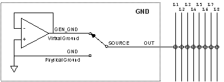

### &#160;[aGND]

 #### METHOD CLEAR

The method CLEAR, sends the instrument a reset command which sets the parameters of the instrument to the default value. (The default values are available in Tab. 51, in appendix A.

&#160;

&#160;

Syntax

 ##### VIVA LANGUAGE

&#160;

~CLEAR AGND;

&#160;

&#160;

&#160;

 #### METHOD SET&#160;

The method SET selects the ground reference of the ACL module, which can be used with the internal measurement lines. The lines of the ACL module can be connected to the physical ground or to the virtual ground. The virtual ground is an equipotent point with the physical ground protected in current.

&#160;

&#160;

Syntax

 ##### VIVA LANGUAGE

&#160;

~SET AGND&#160;&#160;&#160;&#160;&#160; [OUT=option] [SOURCE=option] [TIME_RELE=option]

&#160;

&#160;

Detail of parameters

&#160;

&#160;

OUT=option|value&#160;&#160;&#160;&#160;&#160;&#160; [OPEN|L1|L2|L3|L4|L5|L6|L7|L8, default: NONE]

Defines the lines which will be connected to the ground defined with parameter SOURCE. The possible values for this parameter are:

OPEN | 0XFF&#160;&#160;&#160;&#160;&#160;&#160; The ground of the instruments of the ACL module is disconnected from all the system analog lines.

L1 | 0XFE&#160;&#160;&#160;&#160;&#160;&#160;&#160;&#160;&#160;&#160;&#160; The ground of the instruments of the ACL module is connected to L1.

L2 | 0XFD&#160;&#160;&#160;&#160;&#160;&#160;&#160;&#160;&#160;&#160; The ground of the instruments of the ACL module is connected to L2.

L3 | 0XFB&#160;&#160;&#160;&#160;&#160;&#160;&#160;&#160;&#160;&#160;&#160; The ground of the instruments of the ACL module is connected to L3.

L4 | 0XF7&#160;&#160;&#160;&#160;&#160;&#160;&#160;&#160;&#160;&#160;&#160; The ground of the instruments of the ACL module is connected to L4.

L5 | 0XEF&#160;&#160;&#160;&#160;&#160;&#160;&#160;&#160;&#160;&#160;&#160; The ground of the instruments of the ACL module is connected to L5.

L6 | 0XDF&#160;&#160;&#160;&#160;&#160;&#160;&#160;&#160;&#160;&#160; The ground of the instruments of the ACL module is connected to L6.

L7 | 0XBF&#160;&#160;&#160;&#160;&#160;&#160;&#160;&#160;&#160;&#160;&#160; The ground of the instruments of the ACL module is connected to L7.

L8 | 0X7F&#160;&#160;&#160;&#160;&#160;&#160;&#160;&#160;&#160;&#160;&#160; The ground of the instruments of the ACL module is connected to L8.

&#160;

SOURCE=option|value&#160;&#160; [GND|GEN_GND, default: GND]

Defines the kind of ground used by the instruments of the ACL module. The possible values of this parameter are:

GND | 0&#160;&#160;&#160;&#160;&#160;&#160;&#160;&#160;&#160;&#160;&#160;&#160;&#160;&#160; The ground of the instruments of the ACL module is connected to the physical system ground.

GEN_GND | 1&#160;&#160;&#160;&#160;&#160; The ground of the instruments of the ACL module is connected to the ground supplied by the GND virtual generator.

&#160;

TIME_RELE=option|value&#160;&#160;&#160;&#160;&#160;&#160;&#160;&#160; [ON|OFF, default: ON]

Defines if the output of the instruction ~SET AGNDmust wait for the switching time of the relays used to program the instruments. The possible values of this parameter are:

ON | 0&#160;&#160;&#160;&#160;&#160;&#160;&#160;&#160;&#160;&#160;&#160;&#160;&#160;&#160;&#160;&#160; Before the exit from the command, its waited the switching time of the relays

OFF | 1&#160;&#160;&#160;&#160;&#160;&#160;&#160;&#160;&#160;&#160;&#160;&#160;&#160;&#160;&#160; After programming, the switching time of the relays is not waited before the exit from the command.

The parameter can be useful is case of sequential programming of different instruments: all the programmings previous to the last, may be executed with this paramter set to OFF, only the last one must be executed with the parameter set to ON.

&#160;

All the lines may be connected to ground, anyway, it is important to consider that lines L3 and L7, for their physical features are the most suitable ones for ground references. (wider tracks and spread on PCB surface, etc.)

&#160;

&#160;

&#160;

 &#160;

&#160;

&#160;

&#160;

&#160;

&#160;

&#160;

&#160;

&#160;

&#160;

&#160;

&#160;

&#160;

&#160;

&#160;