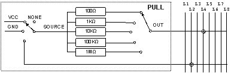

&#160;

 ### &#160;PULL

 #### METHOD CLEAR

The method CLEAR disables the instrument PULL. It sends a reset command to set the instrument parameters to the default value. (See Tab. 51, in appendix A).

&#160;

Syntax

 ##### VIVA LANGUAGE

&#160;

~CLEAR PULL;

&#160;

 #### METHOD SET&#160;

The method SET&#160; selectsthe pull up/down/ext resistances on line L4. The resistances will be pull-up, pull-down or pull-ext according to the value of parameter IN, which defines the reference voltage value.

&#160;

&#160;

Syntax

 ##### VIVA LANGUAGE

&#160;

~SET PULL&#160;&#160;&#160;&#160;&#160;&#160; [VAL=value] SOURCE=option] [TIME_RELE=option]

Detail of parameters

&#160;

VAL=option|value&#160;&#160;&#160;&#160;&#160;&#160;&#160;&#160;&#160; [NONE|100|[1000|1K]|[10000|10K]|[100000|100K]|[1000000|1MEG],

default: NONE|0]

Defines the&#160; resistive value of the pull-up/down resistance. The possible values of the parameter are:

NONE | 0&#160;&#160;&#160;&#160;&#160;&#160;&#160;&#160;&#160;&#160;&#160;&#160; No pull-up/down resistance is connected to line L4.

100 | 1&#160;&#160;&#160;&#160;&#160;&#160;&#160;&#160;&#160;&#160;&#160;&#160;&#160;&#160;&#160; A 100 pull-up/down resistance is connected to line L4.

1K|1000 | 2&#160;&#160;&#160;&#160;&#160;&#160; A 1K pull-up/down resistance is connected to line L4.

10K|10000 | 3&#160;&#160; A 10K pull-up/down resistance is connected to line L4.

100K|100000 | 4&#160;&#160;&#160;&#160; A 100K pull-up/down resistance is connected to line L4.

1MEG|1000000 | 5&#160; A 1M pull-up/down resistance is connected to line L4.

&#160;

SOURCE=option|value&#160;&#160; [NONE|L2|GND|VCC, default: NONE]

Defines the reference of the resistance defined with parameter VAL. The possible values of the parameter are:

NONE | 0&#160;&#160;&#160;&#160;&#160;&#160;&#160;&#160;&#160;&#160;&#160;&#160; The resistance defined with parameter VAL is not connected to a reference point.

L2 | 1&#160;&#160;&#160;&#160;&#160;&#160;&#160;&#160;&#160;&#160;&#160;&#160;&#160;&#160;&#160;&#160;&#160; The resistance defined with parameter VAL is connected to line L2. (PULL-EXT)

GND | 2&#160;&#160;&#160;&#160;&#160;&#160;&#160;&#160;&#160;&#160;&#160;&#160;&#160;&#160; The resistance defined with parameter VAL is connected to the system ground reference. (PULL-DOWN)

VCC | 3&#160;&#160;&#160;&#160;&#160;&#160;&#160;&#160;&#160;&#160;&#160;&#160;&#160;&#160;&#160; The resistance defined with parameter VAL is connected to VCC voltage. (PULL-UP)

&#160;

TIME_RELE=option|value&#160;&#160;&#160;&#160;&#160;&#160;&#160;&#160; [ON|OFF, default: ON]

Defines if the output of the instruction ~SET PULLmust wait the switching time of the relays used to program the instrument. The possible values of the parameter are:

ON | 0&#160;&#160;&#160;&#160;&#160;&#160;&#160;&#160;&#160;&#160;&#160;&#160;&#160;&#160;&#160;&#160; The switching time of the relays is waited before the exit from the command

OFF | 1&#160;&#160;&#160;&#160;&#160;&#160;&#160;&#160;&#160;&#160;&#160;&#160;&#160;&#160;&#160; After programming, the switching time of the relays is waited before the exit from the command

&#160;

The parameter can be useful in case of sequential programming of different instruments: all the programmings but the last may be executed with the value of this parameter set to OFF, only the last one must be executed with this parameter set to ON.

&#160;

&#160;

&#160;

&#160;

&#160;

&#160;

&#160;

&#160;

&#160;

&#160;

&#160;

&#160;

&#160;