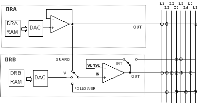

Sintassi

##### 1.1.1.1.1 
 VIVA LANGUAGE

~CLEARAGND;

#### 1.1.1.2 METODO 
 Set 

Il metodo SET seleziona 
 il collegamento di massa del modulo ACL, 
 utilizzabile con le linee interne di misura. Le linee del modulo ACL 
 possono essere connesse alla massa fisica o alla massa 
 virtuale. La massa virtuale un punto equipotenziale con la massa fisica 
 protetto in corrente.

Sintassi

##### 1.1.1.2.1 
 VIVA LANGUAGE

~SET 
 AGND 
 [OUT=option] 
 [SOURCE=option] 
 [TIME_RELE=option]

DETTAGLIO Parametri

OUT=option|value 
 [OPEN|L1|L2|L3|L4|L5|L6|L7|L8, default: NONE]

Definisce 
 le linee che saranno collegate alla massa definita con il parametro SOURCE. 
 Il parametro pu assumere i seguenti valori:

OPEN | 0XFF 
 La massa degli strumenti del modulo ACL 
 sar scollegata da tutte le linee analogiche del sistema.

L1 | 0XFE 
 La massa degli strumenti del modulo ACL 
 sar collegata a L1.

L2 | 0XFD 
 La massa degli strumenti del modulo ACL 
 sar collegata a L2.

L3 | 0XFB 
 La massa degli strumenti del modulo ACL 
 sar collegata a L3.

L4 | 0XF7 
 La massa degli strumenti del modulo ACL 
 sar collegata a L4.

L5 | 0XEF 
 La massa degli strumenti del modulo ACL 
 sar collegata a L5.

L6 | 0XDF 
 La massa degli strumenti del modulo ACL 
 sar collegata a L6.

L7 | 0XBF 
 La massa degli strumenti del modulo ACL 
 sar collegata a L7.

L8 | 0X7F 
 La massa degli strumenti del modulo ACL 
 sar collegata a L8.

SOURCE=option|value 
 [GND|GEN_GND, default: GND]

Definisce 
 il tipo di massa che sar utilizzata dagli strumenti del modulo ACL. Il 
 parametro pu auumere i valori:

GND | 0 
 La massa degli strumenti del modulo ACL 
 sar collegata alla massa fisica del sistema.

GEN_GND | 1 
 La massa degli strumenti del modulo ACL 
 sar collegata alla massa fornita dal generatore di GND virtuale.

TIME_RELE=option|value [ON|OFF, default: ON]

Definisce 
 se luscita dellistruzione ~SETAGND deve 
 attendere il tempo di commutazione dei rel utilizzati per la programmazione 
 dello strumento. Il parametro pu assumere i valori:

ON | 0 
 Prima di uscire dal comando viene atteso 
 il tempo corrispondente al tempo di commutazione dei rel

OFF | 1 
 Dopo la programmazione non viene atteso 
 il tempo di commutazione per uscire dal comando.

Il parametro 
 pu essere utile nel caso di programmazione sequenziale di diversi strumenti 
 prima del loro utilizzo: tutte le programmazioni precedenti lultima, 
 possono essere eseguite con il valore di questo parametro a OFF, solo 
 lultima dovr essere eseguita con il valore del parametro a ON.

Tutte le linee possono 
 essere collegate a massa, comunque opportuno tener presente che le linee 
 L3 ed L7 per le loro caratteristiche fisiche sono le pi indicate per 
 i collegamenti di massa. (piste pi larghe, diffusione pi estesa sulla 
 superfice del cicuito stampato, ecc)

