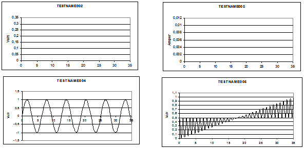

&#160;

&#160;

DETTAGLIO&#160; Parametri

&#160;

V=value&#160;&#160;&#160;&#160;&#160;&#160;&#160;&#160;&#160;&#160;&#160;&#160;&#160;&#160;&#160;&#160;&#160;&#160;&#160;&#160;&#160;&#160;&#160;&#160;&#160;&#160;&#160;&#160;&#160;&#160;&#160;&#160;&#160;&#160; [-10+10V, default: 0V]

Indica il valore di programmazione della tensione in uscita dallo strumento. Se lo strumento programmato in AC il parametro indica il valore della tensione di picco&#160; del segnale in uscita dallo strumento.

&#160;

I=value&#160;&#160;&#160;&#160;&#160;&#160;&#160;&#160;&#160;&#160;&#160;&#160;&#160;&#160;&#160;&#160;&#160;&#160;&#160;&#160;&#160;&#160;&#160;&#160;&#160;&#160;&#160;&#160;&#160;&#160;&#160;&#160;&#160;&#160;&#160; [-0,5+0,5A, default: 0,01A]

Indica il valore di programmazione della massima corrente erogata dallo strumento.

&#160;

OFFSET=value&#160;&#160;&#160;&#160;&#160;&#160;&#160;&#160;&#160;&#160;&#160;&#160;&#160;&#160;&#160;&#160;&#160;&#160;&#160;&#160; [-5+5V, default: 0V]

Indica il valore di offset in tensione del segnale in uscita ed significativo solo quando lo strumento programmato in AC. opportuno tener presente che il valore del parametro OFFSET sommato al valore indicato con il parametri V deve corrispondere ad un valore compreso nellintervallo di validit del parametro V, cio: [-10+10V].

&#160;

RANGE=option|value&#160;&#160;&#160;&#160;&#160;&#160;&#160;&#160; [AUTO|1V|10V, default: AUTO]

Indica il range del segnale fornito in uscita dallo strumento, ovvero un valore di fondo scala che contenga il valore di programmazione dello strumento. Pi il valore del fondo scala prossimo al valore di programmazione dello strumento pi la risoluzione dello strumento sar precisa. Il parametro pu assumere tre possibili valori:

AUTO | 0&#160;&#160;&#160;&#160;&#160;&#160;&#160; indica che il valore del parametro impostato automaticamente in funzione del valore di programmazione della tensione fornita dallo strumento.

1V | 1&#160;&#160;&#160;&#160;&#160;&#160;&#160;&#160;&#160;&#160;&#160;&#160;&#160;&#160; indica che il parametro sar impostato a 1V.

10V | 2&#160;&#160;&#160;&#160;&#160;&#160;&#160;&#160;&#160;&#160;&#160; indica che il parametro sar impostato a 10 V.

&#160;

MODE=option|value&#160;&#160;&#160;&#160;&#160;&#160;&#160;&#160;&#160;&#160; [V|GUARD|FOLLOWER, default: V]

Indica la modalit di funzionamento dello strumento:

V | 0&#160;&#160;&#160;&#160;&#160;&#160;&#160;&#160;&#160;&#160;&#160;&#160;&#160;&#160;&#160;&#160;&#160;&#160;&#160;&#160;&#160;&#160;&#160; Lo strumento viene programmato come generatore di tensione, limitato in corrente.

GUARD | 1&#160;&#160;&#160;&#160;&#160;&#160;&#160;&#160;&#160;&#160;&#160; Lo strumento viene programmato come inseguitore di tensione interna, collegato al generatore DRA. In questa modalit il generatore DRB utilizzato come generatore di guardia sul segnale fornito dal generatore DRA.

FOLLOWER | 2&#160;&#160; Lo strumento viene programmato come inseguitore di una tensione esterna presente su una delle linee L2, L4, L6 o L8 come definito dal parametro IN.

Il valore di default del parametro MODE V.

SENSE=option|value&#160;&#160;&#160;&#160;&#160;&#160;&#160;&#160;&#160; [INT|L4|L5, default: INT]

Definisce la linea del modulo ACL alla quale verr collegato lingresso di SENSE dello strumento DRB. Lingresso di SENSE dello strumento lingresso che fornisce il livello di tensione che si vuole in uscita dello strumento. Il parametro pu assumere i valori:

INT | 0&#160;&#160;&#160;&#160;&#160;&#160;&#160;&#160;&#160;&#160;&#160; Lingresso di SENSE dello strumento e collegato internamente con luscita dello strumento.

L4 | 4&#160;&#160;&#160;&#160;&#160;&#160;&#160;&#160;&#160;&#160;&#160;&#160;&#160;&#160; Lingresso di SENSE dello strumento e collegato alla linea di misura interna L4.

L5 | 5&#160;&#160;&#160;&#160;&#160;&#160;&#160;&#160;&#160;&#160;&#160;&#160;&#160;&#160; Lingresso di SENSE dello strumento e collegato alla linea di misura interna L5.

&#160;

FREQ=value&#160;&#160;&#160;&#160;&#160;&#160;&#160;&#160;&#160;&#160;&#160;&#160;&#160;&#160;&#160;&#160;&#160;&#160;&#160;&#160;&#160;&#160;&#160;&#160;&#160; [0,00150.000.000Hz, default: 1.000Hz]

Indica il valore in frequenza del segnale in uscita ed significativo per valori del parametro WAVE diversi da DC.

Il parametro espresso in Hertz, pu assumere valori:

-&#160;&#160;&#160;&#160;&#160;&#160;&#160;&#160;&#160;&#160;&#160; 0,0013.000.000 per forme donda generate con la tecnica DDS

-&#160;&#160;&#160;&#160;&#160;&#160;&#160;&#160;&#160;&#160;&#160; 100050.000.000 per forme donda generate con la tecnica PPC.

&#160;

TIME=value&#160;&#160;&#160;&#160;&#160;&#160;&#160;&#160;&#160;&#160;&#160;&#160;&#160;&#160;&#160;&#160;&#160;&#160;&#160;&#160;&#160;&#160;&#160;&#160;&#160; [0,000011 sec, default: 0,001sec]

Indica il valore del tempo impiegato dal generatore per passare da un livello di programmazione del segnale in uscita al valore successivo ed significativo quando il parametro WAVE ha valore DC. In altre parole definisce la rampa di salita o discesa del segnale.

&#160;

WAVE=option|value&#160;&#160;&#160;&#160;&#160;&#160;&#160;&#160;&#160;&#160;&#160; [DC|SIN|TRI|RECT|ARB1ARB10|VECT1VECT10, default: DC]

Definisce la forma donda in uscita dal generatore e pu assumere i valori:

DC | 0&#160;&#160;&#160;&#160;&#160;&#160;&#160;&#160;&#160;&#160;&#160;&#160;&#160;&#160;&#160;&#160;&#160;&#160;&#160;&#160;&#160;&#160;&#160;&#160;&#160;&#160;&#160;&#160;&#160;&#160;&#160;&#160; Il segnale in uscita un segnale coninuo.

SINE | 1&#160;&#160;&#160;&#160;&#160;&#160;&#160;&#160;&#160;&#160;&#160;&#160;&#160;&#160;&#160;&#160;&#160;&#160;&#160;&#160;&#160;&#160;&#160;&#160;&#160;&#160;&#160;&#160; La forma donda del segnale in uscita sinusoidale.

TRI | 2&#160;&#160;&#160;&#160;&#160;&#160;&#160;&#160;&#160;&#160;&#160;&#160;&#160;&#160;&#160;&#160;&#160;&#160;&#160;&#160;&#160;&#160;&#160;&#160;&#160;&#160;&#160;&#160;&#160;&#160; La forma donda del segnale in uscita triangolare.

RECT | 3&#160;&#160;&#160;&#160;&#160;&#160;&#160;&#160;&#160;&#160;&#160;&#160;&#160;&#160;&#160;&#160;&#160;&#160;&#160;&#160;&#160;&#160;&#160;&#160;&#160;&#160; La forma donda del segnale in uscita rettangolare.

|4|5|6|7|8|9|10|11|

12|13

 &#160;

 ARB1ARB10 |&#160;&#160;&#160;&#160;&#160;&#160;&#160;&#160;&#160;&#160;&#160; La forma donda del segnale in uscita ha una forma donda descritta da 32 KW di valori registrati in una flash memory presente nel modulo ACL. Per la generazione delle forme donda del tipo SIN, TRI, RECT, ARB1ARB10 utilizzata la tecnica DDS.

|14|15|16|17|18|19|

20|21|22|23

 &#160;

 VECT1VECT10 |&#160;&#160;&#160;&#160;&#160; La forma donda del segnale in uscita ha una forma donda descritta da un numero variabile di valori registrati in una flash memory presente nel modulo ACL. Per la generazione delle forme donda del tipo VECT1VECT10 utilizzata la tecnica PPC.

&#160;

START=option|value&#160;&#160;&#160;&#160;&#160;&#160;&#160;&#160;&#160; [IMMEDIATE|CNT_START|CNT_STOP|CNT_COMP|HW1|HW2|SW1

|CLEAR|STOP_EV, default: IMMEDIATE]

Indica la modalit di partenza per la generazione del segnale. Il parametro pu assumere sette possibili valori:

IMMEDIATE | 0&#160;&#160;&#160;&#160;&#160; Indica che la generazione del segnale in uscita inizier immediatamente.

CNT_START | 1&#160;&#160;&#160;&#160;&#160;&#160; Indica che la generazione del segnale in uscita inizier al manifestarsi dellevento Start Trigger dello strumento SCOUNTER presente sul modulo ACL.

CNT_STOP | 2&#160;&#160;&#160;&#160;&#160;&#160;&#160;&#160;&#160; Indica che la generazione del segnale in uscita inizier al manifestarsi dellevento Stop Trigger dello strumento SCOUNTER presente sul modulo ACL.

CNT_COMP | 3&#160;&#160;&#160;&#160;&#160;&#160;&#160; Indica che la generazione del segnale in uscita inizier al manifestarsi dellevento Compare dello strumento SCOUNTER presente sul modulo ACL.

HW1 | 4&#160;&#160;&#160;&#160;&#160;&#160;&#160;&#160;&#160;&#160;&#160;&#160;&#160;&#160;&#160;&#160;&#160;&#160;&#160;&#160;&#160; Indica che la generazione del segnale in uscita inizier con lattivazione del segnale HW1 proveniente dallesterno del modulo ACL. (nome segnale: RTCIN1).

HW2 | 5&#160;&#160;&#160;&#160;&#160;&#160;&#160;&#160;&#160;&#160;&#160;&#160;&#160;&#160;&#160;&#160;&#160;&#160;&#160;&#160;&#160; Indica che la generazione del segnale in uscita inizier con lattivazione del segnale HW2 proveniente dallesterno del modulo ACL. (nome segnale: RTCIN2).

SW1 | 6&#160;&#160;&#160;&#160;&#160;&#160;&#160;&#160;&#160;&#160;&#160;&#160;&#160;&#160;&#160;&#160;&#160;&#160;&#160;&#160;&#160;&#160; Indica che la generazione del segnale in uscita inizier al manifestarsi dellevento Trigger SW1, che pu essere generato dagli strumenti IMM e SCOUNTER.

CLEAR | 7&#160;&#160;&#160;&#160;&#160;&#160;&#160;&#160;&#160;&#160;&#160;&#160;&#160;&#160;&#160;&#160; Indica che il driver verr programmato senza far partire la generazione del segnale in uscita dallo strumento. Per far partire la generazione sar necessario eseguire una istruzione ~SET DRB con il valore assegnato al parametro START diverso da CLEAR.

STOP_EVO | 8&#160;&#160;&#160;&#160;&#160;&#160;&#160;&#160; Indica che verr fermata la generazione continua del segnale impostata con il parametro EVOLUTION=0 dellistruzione ~SET DRA precedente.

&#160;

N_SAMPLE=value&#160;&#160;&#160;&#160;&#160;&#160;&#160;&#160;&#160;&#160;&#160;&#160;&#160;&#160; [032.768, default: 1.000]

Indica il numero di campioni da utilizzare quando la forma donda generata con la tecnica PPC.

&#160;

ADDR=value&#160;&#160;&#160;&#160;&#160;&#160;&#160;&#160;&#160;&#160;&#160;&#160;&#160;&#160;&#160;&#160;&#160;&#160;&#160;&#160;&#160;&#160;&#160;&#160;&#160; [032.768, default: 0]

Indica lindirizzo di partenza, allinterno dellintervallo degli indirizzi di memoria che descrivono la forma donda selezionata con il parametro WAVE, dal quale si inizia la scansione dei valori per generare il segnale duscita.

&#160;

DELAY_TRIG=value&#160;&#160;&#160;&#160;&#160;&#160;&#160;&#160;&#160; [0,0000000260sec, default: 0sec]

Indica il ritardo programmato dallevento di trigger alla generazione del segnale in uscita dallo strumento. Per evento di trigger si intende la modalit di partenza per la generazione del segnale, definita con il parametro START.

&#160;

EVOLUTION=value&#160;&#160;&#160;&#160;&#160;&#160;&#160;&#160;&#160;&#160;&#160; [065.535, default: 1]

Indica il numero di ripetizioni di un ciclo completo della forma donda selezionata ed significativo per valori del parametro WAVE diversi da DC.

Un valore 0 associato al parametro ha il significato di CONTINUE, cio generazione continua del segnale in uscita.

&#160;

IN=option|value&#160;&#160;&#160;&#160;&#160;&#160;&#160;&#160;&#160;&#160;&#160;&#160;&#160;&#160;&#160;&#160;&#160;&#160;&#160; [DAC|L2|L4|L6|L8, default: DAC]

Definisce la linea del modulo ACL alla quale verr collegato lingresso dello strumento DRB, pu assumere i valori:

DAC | 0&#160;&#160;&#160;&#160;&#160;&#160;&#160;&#160;&#160;&#160; Lo strumento collegato internamente al DAC presente sulluscita del generatore di forme donda, sia DDS che PPC.

L2 | 2&#160;&#160;&#160;&#160;&#160;&#160;&#160;&#160;&#160;&#160;&#160;&#160;&#160;&#160; Lo strumento collegato alla linea interna di misura L2.

L4 | 4&#160;&#160;&#160;&#160;&#160;&#160;&#160;&#160;&#160;&#160;&#160;&#160;&#160;&#160; Lo strumento collegato alla linea interna di misura L4.

L6 | 6&#160;&#160;&#160;&#160;&#160;&#160;&#160;&#160;&#160;&#160;&#160;&#160;&#160;&#160; Lo strumento collegato alla linea interna di misura L6.

L8 | 8&#160;&#160;&#160;&#160;&#160;&#160;&#160;&#160;&#160;&#160;&#160;&#160;&#160;&#160; Lo strumento collegato alla linea interna di misura L8.

&#160;

OUT=option|value&#160;&#160;&#160;&#160;&#160;&#160;&#160;&#160;&#160;&#160;&#160;&#160;&#160;&#160; [NONE|L1|L2|L3|L4|L5|L7|L4HF, default: NONE]

Definisce la linea del modulo ACL alla quale verr collegato luscita dello strumento DRB, pu assumere i valori:

NONE | 0&#160;&#160;&#160;&#160;&#160;&#160;&#160; Lo strumento non collegato ad alcuna linea interna di misura.

L1 | 1&#160;&#160;&#160;&#160;&#160;&#160;&#160;&#160;&#160;&#160;&#160;&#160;&#160;&#160; Luscita dello strumento collegato alla linea interna di misura L1.

L2 | 2&#160;&#160;&#160;&#160;&#160;&#160;&#160;&#160;&#160;&#160;&#160;&#160;&#160;&#160; Luscita dello strumento collegato alla linea interna di misura L2.

L3 | 3&#160;&#160;&#160;&#160;&#160;&#160;&#160;&#160;&#160;&#160;&#160;&#160;&#160;&#160; Luscita dello strumento collegato alla linea interna di misura L3.

L4 | 4&#160;&#160;&#160;&#160;&#160;&#160;&#160;&#160;&#160;&#160;&#160;&#160;&#160;&#160; Luscita dello strumento collegato alla linea interna di misura L4.

L5 | 5&#160;&#160;&#160;&#160;&#160;&#160;&#160;&#160;&#160;&#160;&#160;&#160;&#160;&#160; Luscita dello strumento collegato alla linea interna di misura L5.

L7 | 7&#160;&#160;&#160;&#160;&#160;&#160;&#160;&#160;&#160;&#160;&#160;&#160;&#160;&#160; Luscita dello strumento collegato alla linea interna di misura L7.

L4HF | 9&#160;&#160;&#160;&#160;&#160;&#160;&#160;&#160; Luscita ad alta freqenza dello strumento collegato alla linea interna di misura L4. Luscita ad alta frequenza luscita che dovrebbe essere utilizzata quando il generatore programmato per fornire prestazioni ad alta frequenza come descritto in 2.1.3.

&#160;

DOMAIN=option|value&#160;&#160;&#160;&#160;&#160;&#160; [DRA|PC|ALL, default: DRB]

Questo parametro permette di sincronizzare lesecuzione del programma in funzione dello stato del modulo ACL, dello strumento DRB o di nessuno dei due.

Il parametro pu assumere i valori:

DRB | 0&#160;&#160;&#160;&#160;&#160;&#160;&#160;&#160;&#160;&#160; indica che il controllo sar posseduto dal modulo ACL che lo liberer al termine del fine run DRB

PC | 1&#160;&#160;&#160;&#160;&#160;&#160;&#160;&#160;&#160;&#160;&#160;&#160;&#160; indica che il controllo rester posseduto dal Main Computer senza eseguire alcuna attesa sul fine run DRB o fine ran di tutti gli strumenti.

ALL | 2&#160;&#160;&#160;&#160;&#160;&#160;&#160;&#160;&#160;&#160; indica che il controllo sar posseduto dal modulo ACL che lo liberer al termine del fine run di tutti gli strumenti utilizzati

&#160;

TIME_RELE=option|value&#160;&#160; [ON|OFF, default: ON]

Definisce se delluscita dal comando deve attendere il tempo di commutazione dei rel utilizzati per la programmazione dello strumento, pu assumere i valori:

ON | 0&#160;&#160;&#160;&#160;&#160;&#160;&#160;&#160;&#160;&#160;&#160;&#160;&#160; prima di uscire dal comando viene atteso il tempo corrispondente al tempo di commutazione dei rel

OFF | 1&#160;&#160;&#160;&#160;&#160;&#160;&#160;&#160;&#160;&#160; dopo la programmazione non viene atteso il tempo di commutazione per uscire dal comando.

Il parametro pu essere utile nel caso di programmazione sequenziale di diversi strumenti prima del loro utilizzo: tutte le programmazioni precedenti lultima, possono essere eseguite con il valore di questo parametro a OFF, solo lultima dovr essere eseguita con il valore del parametro a ON.

&#160;

&#160;

&#160;

&#160;

&#160;

&#160;

&#160;

&#160;

&#160;

&#160;

&#160;

&#160;

&#160;

&#160;

Le figure che segue evidenzia graficamente il flusso dei dati e le connessione fisiche dei due generatori DRA e DRB.

&#160;

&#160;

&#160;

&#160;

&#160;

&#160;

&#160;

&#160;

&#160;

&#160;

&#160;

&#160;

&#160;

&#160;

&#160;

&#160;

&#160;