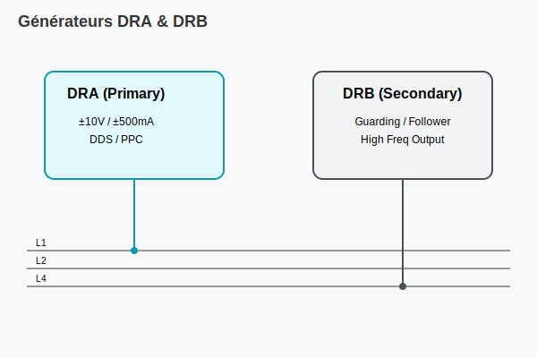

# Générateurs DRA & DRB (ACL Module)

## Présentation
Le module ACL contient deux générateurs de formes d'ondes arbitraires synchrones (DC à 200KHz / 1MHz).

### Spécifications DRA
- **Tension :** ±10V (Résolution 1.25mV)
- **Courant :** ±500mA (Résolution 62.5µA)
- **Modes :** DC, SINE, TRI, RECT, ARB (32K words memory)

### Spécifications DRB
- **Tension :** ±10V
- **Courant (Limite) :** ±500mA
- **Usage :** Souvent utilisé pour le **Guarding** en mode suiveur de tension (FOLLOWER).

## Commandes VIVA
- `~SET DRA` : Configuration du driver primaire.
- `~SET DRB` : Configuration du driver secondaire.
- `~CLEAR DRA/DRB` : Déconnexion et reset.

