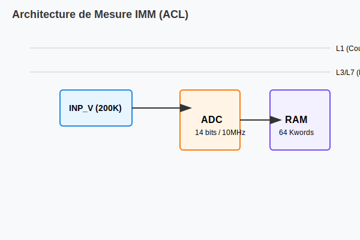

# Multimètre Interne IMM (ACL Module)

## Présentation
L'IMM est l'instrument de mesure principal du module ACL. Il permet des mesures différentielles de haute précision.

### Caractéristiques
- **Résolution :** 14 bits.
- **Fréquence d'échantillonnage :** Jusqu'à 10MSp/sec.
- **Mémoire :** 64 Kwords par buffer (V et I).

### Modes de mesure
- **DC :** Max, Min, Moyenne.
- **AC :** Peak, Peak-to-Peak, RMS.
- **Temporel :** dV/dT, dI/dT.
- **Fréquentiel :** Analyse FFT (Module et Phase).

## Architecture de connexion
L'IMM utilise les lignes internes L1 (Courant) et les pôles INP_VPOS / INP_VNEG pour la tension.

## Commandes VIVA
- `~SET IMM` : Configuration des gammes et du trigger.
- `~MEAS IMM` : Récupération des résultats depuis les buffers.
