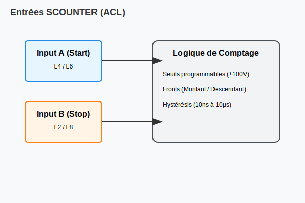

# Compteur / Fréquencemètre SCOUNTER (ACL Module)

## Présentation
Le SCOUNTER est un instrument universel pour la mesure de temps, de fréquence et le comptage d'impulsions.

### Caractéristiques
- **Canaux :** CHA (Start) et CHB (Stop).
- **Gamme de fréquence :** 0.1Hz à 10MHz.
- **Précision :** ±10ppm.
- **Entrées :** Haute impédance (100KΩ / 1MΩ).

## Architecture des entrées
Le SCOUNTER peut être connecté à différentes lignes de mesure internes pour capturer les événements.

## Commandes VIVA
- `~SET SCOUNTER` : Configuration des seuils, des fronts et du mode (FREQ, PERIOD, COUNT).
- `~MEAS SCOUNTER` : Lecture de la valeur mesurée.
- `~CLEAR SCOUNTER` : Reset de l'instrument.
