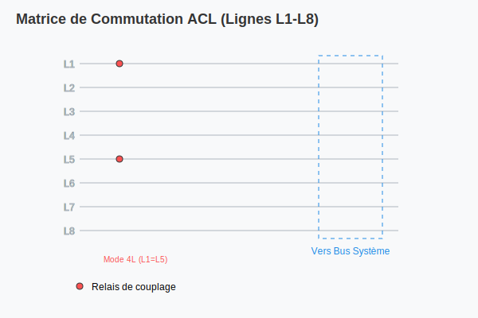

# Pilotage des Lignes et Masses (ACL Module)

## Gestion des Lignes (~SET LINE)
Permet de connecter les 8 lignes de mesure internes au bus analogique du système.
- **Mode 8L :** 8 lignes indépendantes.
- **Mode 4L :** Lignes couplées (L1=L5, L2=L6, etc.).

## Masse Analogique (~SET AGND)
Définit la référence de masse pour les lignes de mesure.
- **GND :** Masse physique du système.
- **GEN_GND :** Masse virtuelle générée.

## Résistances de Tirage (~SET PULL)
Active des résistances de Pull-Up ou Pull-Down sur la ligne **L4**.
- Valeurs : 100, 1K, 10K, 100K, 1M.

