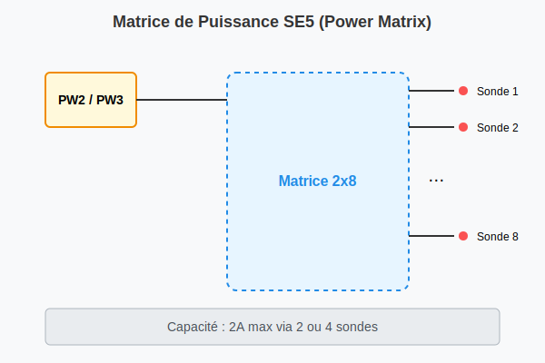

# Carte SE5 (Power Supply Management)

## Présentation
La carte SE5 est un module système dédié à la gestion des unités d'alimentation (PW). Elle remplace et améliore le module SE2 tout en conservant la compatibilité logicielle.

### Caractéristiques principales
- **Gestion de l'alimentation :** Jusqu'à 8 unités PW.
- **Matrice de Puissance :** Permet d'utiliser 2 ou 4 sondes de test (Flying Probes) pour alimenter l'UUT jusqu'à **2 A**.
- **Résolution :** Amélioration des DAC et ADC à **16 bits** pour la programmation et le sensing.
- **Isolation :** Programmation de tension/courant isolée (0-5V ou 0-10V) pour 6 unités.

## Capacités de pilotage
- **Unités 1 à 6 :** Programmation V/I isolée, interconnexion de puissance via relais, feedback V/I isolé, fermeture de Sense via relais.
- **Unités 1 à 8 :** Commande ON/OFF, programmation V/I, feedback V/I.
- **Matrice de Sondes (2x8) :** Interconnexion des sondes de puissance (PW2, PW3 ou ALI EXT).

## Connectique (Front Plate)
- **J3 (PWR OUT) :** Connecteur DIN 41612R 96-voies pour les sorties de puissance.
- **J5/J6 (PW RPROBE) :** Connexion de la matrice vers les têtes de test (1-4 et 5-8).
- **J7 (EXT PWR IN) :** Entrée d'alimentation externe.
- **JP2 (EXT PWR PROG) :** Signaux de programmation pour alimentations externes.

## Compatibilité Logicielle
La carte SE5 est compatible avec les commandes `~SET PWn` et `~MEAS PWn` utilisées pour le module SE2. De nouvelles instructions spécifiques permettent d'exploiter les capacités étendues de la matrice de puissance.
