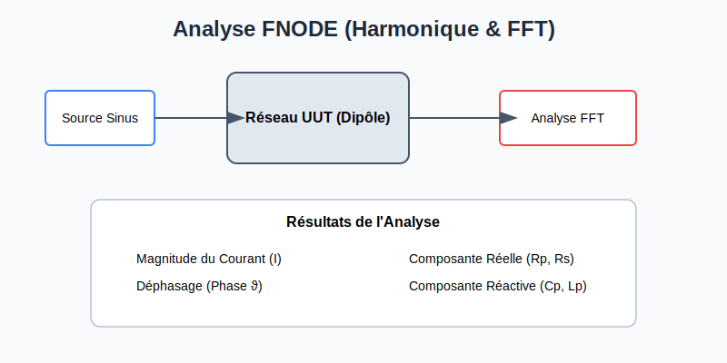

# Macros de Test Analogique (R, C, L)

Ces macros permettent de tester les composants passifs sur l'UUT en utilisant les instruments internes du système.

## RESISTOR
Mesure de résistance.
- **Paramètres Principaux :** Value (Ω), TolPos (%), TolNeg (%), Pin1, Pin2.
- **Options :** SensePin1/2, GuardPin1/2, MeasureMode (DC_ACTIVE, DC_PASSIVE).
- **Note :** Supporte les mesures 2, 3, 4 et 6 fils.

## CAPACITOR
Mesure de capacité.
- **Paramètres Principaux :** Value (Farad), TolPos (%), TolNeg (%), Pin1, Pin2.
- **Options :** ResSer (Résistance série), ResPar (Résistance parallèle), Frequency (Hz).
- **Note :** Le système calcule automatiquement les impédances parasites lors de l'Autodebug.

## INDUCTOR
Mesure d'inductance.
- **Paramètres Principaux :** Value (Henry), TolPos (%), TolNeg (%), Pin1, Pin2.
- **Options :** Volt (Tension d'excitation), Frequency (Hz), SettlingWave.

## FNODE (Analyse de Nœud)
Analyse harmonique d'un réseau complexe (dipôle) via FFT.
- **Usage :** Test de "One Touch Per Net" (OTPN) pour vérifier l'intégrité des pistes et la présence de composants sans accès direct.
- **Paramètres :** StartFreq, StopFreq, BurstNR, Volt, ViewMode (Current, Phase, Rp, Cp, etc.).

