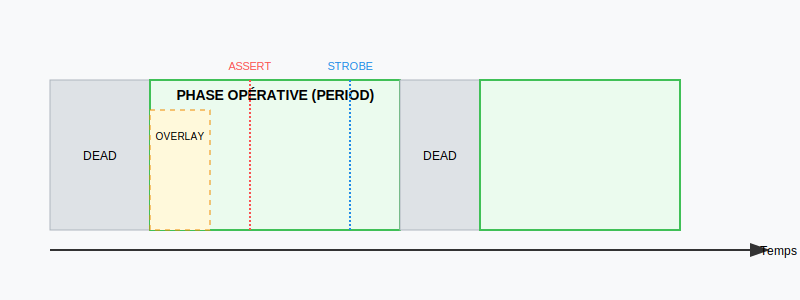

# Timing et Patterns (Synchronisation Haute Vitesse)

## Le Timing du Pattern
Le timing définit la chronologie des événements à l'intérieur d'un cycle de test (Pattern).

### Paramètres de Temps Clés :
- **PERIOD :** Durée totale de la phase exécutive du pattern.
- **DEAD :** Temps réservé à la programmation des canaux *avant* la phase opérative.
- **OVERLAY :** Temps de programmation des canaux *pendant* la phase opérative (optimisation).
- **PHASE (1-9) :** Instants de commutation des drivers (commutation précise).
- **ASSERT :** Instant de commutation simultanée pour les canaux programmés en `AL`, `AH` ou `AS`.
- **STROBE :** Instant (ou fenêtre) de lecture des réponses sur les capteurs (sensors).

---

## Spécificités du Module F40
Le module F40 (25MHz) offre des capacités de timing avancées :
- Jusqu'à **9 phases** et **9 strobes**.
- **Strobe Window :** Vérification continue du signal entre deux instants.
- **Return to 0/1 (R0/R1) :** Génération automatique d'impulsions calibrées.

---

## Contrôle du Flux Dynamique
- **/ JUMP :** Saut vers un label à l'intérieur d'un pattern.
- **/ REPEAT :** Répétition d'un pattern (jusqu'à 65 000 fois).
- **BEGINLOOP / ENDLOOP :** Boucles imbriquées (jusqu'à 3 niveaux) pour les séquences complexes.
