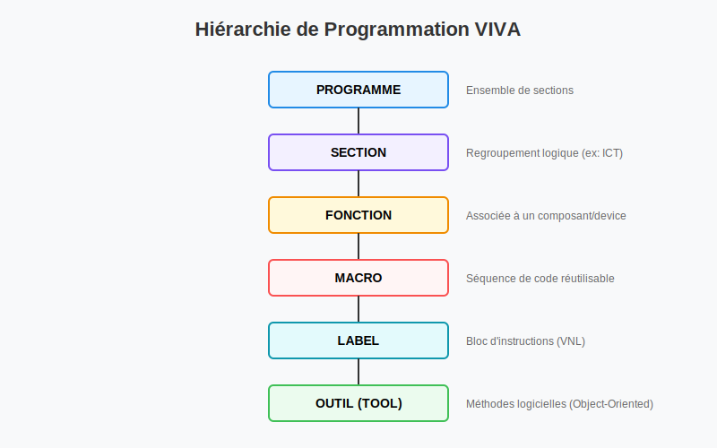

# Guide du Langage VIVA (Native & Native Dynamic)

## Environnements Statique et Dynamique
Le langage VIVA opère dans deux contextes distincts :

### 1. Environnement STATIQUE (`STATIC`)
- **Usage :** Initialisation, messages à l'opérateur, mise sous tension (`POWERON`), configuration des instruments.
- **Instructions :** Commencent généralement par `~` ou `&`.
- **Exécution :** Séquentielle, gérée par le PC principal.

### 2. Environnement DYNAMIQUE (`DYNAMIC` / `DMASTER`)
- **Usage :** Exécution de patterns de test à haute fréquence, stimuli synchronisés.
- **Instructions :** Directives de compilateur (commençant par `@`) et patterns (séparés par `/`).
- **Exécution :** Temps réel, gérée par le contrôleur de module (DSP).

---

## Structure d'un fichier de test (.pat)
Un programme fonctionnel suit une structure rigide :
1. **Directives Compilateur :** `@COMPILER ...`
2. **Déclaration du TIMING :** `TIMING ... ENDTIMING;`
3. **Déclarations d'objets :** `DECLARE CHANNEL`, `DECLARE GROUP`, `DECLARE VARIABLE`.
4. **Déclarations de Macros :** `@MACRO ... @ENDMACRO;`
5. **Déclarations de Sous-routines :** `~SUBR ... ~ENDSUBR;`
6. **Bloc Principal :** `START <nom> STATIC; ... ENDTEST;`

---

## Variables et Constantes
- **INTEGER :** 32 bits signés (-2,147,483,648 à +2,147,483,647).
- **FLOAT :** Virgule flottante double précision.
- **STRING :** Jusqu'à 255 caractères (statique) ou 80 (runtime).
- **Tableaux (Arrays) :** Supportés pour INTEGER, FLOAT et STRING.
- **Registres REG :** 100 registres flottants (REG1-REG100) pour les calculs et l'affichage graphique (`~CURSOR`).

---

## Gestion des Erreurs (Flags)
VIVA utilise deux types de drapeaux d'erreur :
- **Partial Error Flag :** Activé par l'échec du test courant. Utilisé pour les branchements conditionnels (`~BRANCH ONERROR`).
- **Global Error Flag :** Activé dès qu'une erreur survient dans le programme. Si ce flag est actif à la fin, le programme retourne "FAIL".

