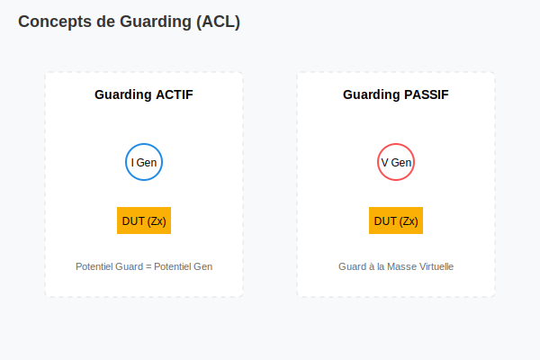

# Mesures Composées (Compound Instruments)

## Présentation
Ces commandes simulent des instruments de mesure de composants (R, C, L) en pilotant automatiquement les générateurs et l'IMM.

## Types de mesures
- **~MEAS RES :** Mesure de résistance (2, 4, 3 ou 6 fils).
- **~MEAS CAP :** Mesure de capacité.
- **~MEAS IND :** Mesure d'inductance.
- **~MEAS JUN :** Test de jonction (Diodes, Zener, LED).
- **~MEAS SHORT :** Test de court-circuit sur lit de clous.

## Concept de Guarding
Le module ACL supporte le guarding actif et passif pour isoler le composant testé des impédances parallèles du circuit.

