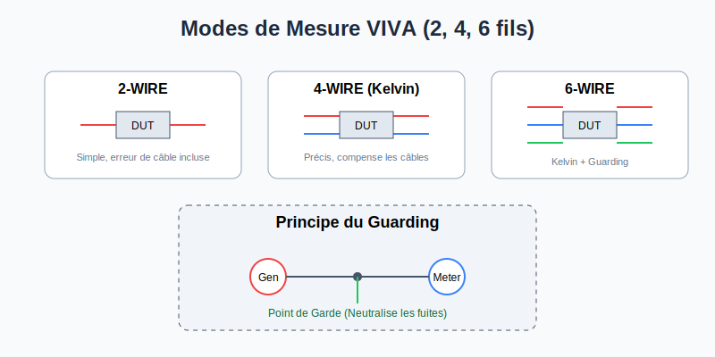

# Méthodes de Mesure VIVA

Le système VIVA permet d'effectuer des mesures de précision sur les composants passifs (R, C, L) en utilisant différentes configurations de câblage pour compenser les impédances parasites et les courants de fuite.

## Configurations de Câblage
| Méthode | Description | Usage |
| :--- | :--- | :--- |
| **2-WIRE** | Le voltmètre est connecté aux mêmes canaux que le générateur. | Mesures simples où la résistance des câbles est négligeable. |
| **3-WIRE** | Similaire au 2-fils, mais avec un troisième fil utilisé pour le **Guarding**. | Élimination des chemins de courant parallèles (fuites). |
| **4-WIRE** | Le voltmètre est connecté à l'UUT via des canaux distincts du générateur (**Kelvin**). | Mesures de faibles résistances (élimine l'erreur due aux câbles). |
| **6-WIRE** | Combine le 4-fils (Kelvin) avec deux fils supplémentaires pour le Guarding et le Guarding Sense. | Précision maximale dans des environnements complexes. |

## Types de Guarding
- **ACTIVE GUARDING :** Utilise un générateur de garde pour maintenir les points de garde au même potentiel que le signal, annulant ainsi les fuites.
- **PASSIVE GUARDING :** Connecte les points de garde à une référence (généralement la masse) pour dévier les courants indésirables.

## Hiérarchie d'Exécution
1. **VIVA Program :** Séquence de fonctions.
2. **VIVA Function :** Ensemble de macros associées à un composant.
3. **System Macros :** Code exécutable pilotant les instruments.
4. **Drivers / DSP :** Couche logicielle bas niveau gérant le matériel en temps réel.

