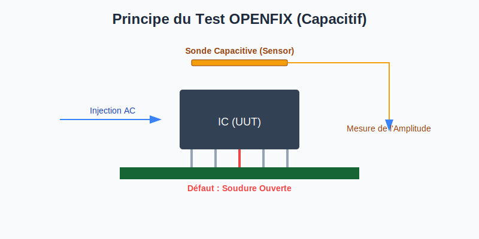

# Macros Vectorless et Utilitaires de Service

Ces macros permettent de tester les circuits intégrés sans vecteurs de test et gèrent les interactions utilisateur ainsi que la sécurité de la carte.

## Tests Vectorless (Hors Tension)
| Macro | Description | Usage |
| :--- | :--- | :--- |
| **AUTIC** | Test de protection des diodes d'entrée/sortie des IC. | Détection de composants manquants ou inversés. |
| **JSCAN** | Test basé sur le comportement de transistor équivalent entre deux pins. | Vérification de l'intégrité des soudures sur les IC complexes. |
| **OPENFIX** | Utilise une sonde capacitive mobile ou fixe au-dessus de l'IC. | Détection ultra-précise des broches ouvertes (soudures sèches). |

## Macros de Service et Sécurité
- **JUMPER :** Vérifie l'état (ouvert/fermé) d'un cavalier ou d'un pont de soudure.
- **FUSE :** Mesure la chute de tension pour vérifier l'intégrité d'un fusible.
- **DISCHARGE :** Décharge les condensateurs de l'UUT avant le test pour protéger les instruments.
- **SOLD :** Macro spécifique pour le pilotage du module de brasage laser.

## Interaction Utilisateur (VBScript)
- **MESSAGE :** Affiche une boîte de dialogue d'information ou d'instruction.
- **ASKUSER :** Invite l'opérateur à saisir une valeur ou à confirmer une action (Yes/No).

